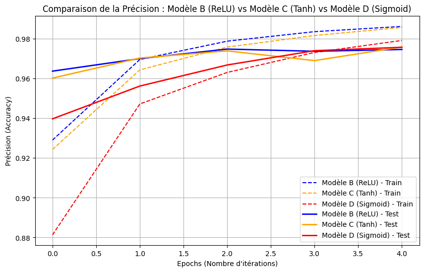

# TP1_MNIST_IA_Embarquee

## Introduction :

Ce projet a pour objectif de résoudre le problème MNIST. Le jeu de données MNIST est un benchmark classique en apprentissage automatique pour la classification d'images , qui contient des images en niveaux de gris de chiffres manuscrits (de 0 à 9).  L'objectif de ce modèle est de prédire correctement la classe (le chiffre) associée à chaque image parmi les 10 classes possibles. Sachant que chaque image est de taille 28/28 pixels, soit [1x784] pixels au total , celle-ci est systématiquement transformée en un vecteur aplati de dimension 784 pour la phase d'entraînement.

## 1. Choix de la Fonction d’Activation

Dans cette première partie, notre but est de comprendre comment la "forme" de notre intelligence artificielle (ses couches) et sa méthode d'activation influencent ses résultats. [cite_start]Pour que le test soit juste, nous gardons la même base de calcul pour tout le monde : l'optimiseur `adam` et la fonction d'erreur `categorical_crossentropy`.

### Les 4 modèles testés

Nous avons créé quatre versions de notre réseau d'apprentissage  :

* **a. Modèle A (Le plus basique) :** C'est un réseau direct, sans étape intermédiaire de réflexion (sans "couche cachée"). L'image entre d'un côté et le résultat sort de l'autre avec la fonction "Softmax". C'est une approche très simple et très légère.
* **b. Modèle B (ReLU) :** C'est un réseau plus profond. On lui a ajouté deux étapes intermédiaires de calcul (des couches cachées) et on utilise la fonction "ReLU" pour l'aider à apprendre.
* **c. Modèle C (Tanh) :** C'est exactement la même construction que le Modèle B, mais on utilise une méthode mathématique différente appelée "Tanh".
* **d. Modèle D (Sigmoid) :** Toujours la même construction, mais avec une méthode plus ancienne appelée "Sigmoid".

### Les résultats après 5 lectures des données (5 Epochs)

- Le modèle A n'est pas présent sur le graphique car il n'est pas assez précis pour le comparer à nos 3 autres modèles.

Voici un tableau pour résumer ce que nous avons observé :

| Modèle testé | Taille | Précision | Vitesse d'apprentissage |
| :--- | :--- | :--- | :--- |
| **A (Softmax - Basique)** | Très léger (~7 800 paramètres) | ~92.6% | Moyenne  |
| **B (ReLU)** | Lourd (109 386 paramètres) | ~97.5% | Très rapide |
| **C (Tanh)** | Moyen (55 050 paramètres) | ~97.6% | Très rapide |
| **D (Sigmoid)** | Moyen (55 050 paramètres) | ~97.4% | Lente |

---

L'évaluation d'une intelligence artificielle repose sur un compromis essentiel entre sa taille en mémoire, son temps d'apprentissage (les epochs) et sa précision finale. Bien que le Modèle A soit très léger en mémoire, sa simplicité limite sa précision à 92,6 %, là où les modèles B, C et D exigent 14 fois plus d'espace mais dépassent les 97 % de réussite.

Sanchant que `Tanh` est plus léger avec 2 couches tout en restant très rapide et précis c'est ici la meilleur option à opter pour choisir notre fonction d'activation.

## 2. Choix de l’Algorithme d’Optimisation

Suite à nos premières expériences, nous avons gardé notre meilleure configuration.

Notre but est maintenant de choisir le meilleur algorithme d'optimisation. C'est en quelque sorte la méthode mathématique utilisée pour corriger les erreurs de la machine après chaque lecture des données pour qu'elle s'améliore.

### Les 4 méthodes testées

Nous avons mis en compétition quatre algorithmes différents, avec des stratégies distinctes:

* **SGD (La base) :** C'est la technique classique et simple, qui donne une bonne intuition sur la descente de gradient.
* **Adam (Le moderne) :** Une méthode très populaire aujourd'hui qui combine d'autres techniques pour converger (apprendre) très vite.
* **RMSprop (L'équilibré) :** Un algorithme qui adapte automatiquement son taux d'apprentissage pour rester stable face à des entrées variées.
* **Adagrad (Le spécifique) :** Il donne un rythme d'apprentissage (learning rate) différent pour chaque paramètre.

### Les résultats après 5 lectures (Epochs)

**Analyse des performances vues sur le graphique :**

1.  **Adam (Orange) et RMSprop (Vert) :** Ces deux algorithmes dominent largement. Dès la toute première lecture, ils propulsent la machine à plus de 96% de bonnes réponses, pour finir en frôlant les 98%. Ils sont capables de trouver les bons réglages de manière presque instantanée.
2.  **SGD (Bleu) :** Sa progression est très régulière et forme une belle ligne qui monte doucement. Il commence plus bas (environ 91%) et finit à 95%. Il est fiable, mais il a besoin de beaucoup plus de temps et de lectures (plus d'epochs) pour espérer atteindre le niveau d'Adam.
3.  **Adagrad (Rouge) :** Sur notre test, c'est lui qui a le plus de mal à démarrer (sous les 85%). Même s'il progresse de façon constante, il finit bon dernier autour de 91%. Son rythme d'apprentissage s'est probablement réduit un peu trop vite, l'empêchant de rattraper les autres.

L'optimiseur **Adam** confirme qu'il est le choix idéal.

## 3. Choix de la Fonction Coût

Le choix de la fonction de coût dépend directement du type de problème que l'on traite et de la sortie produite par le modèle.

### Les différentes fonctions selon le problème

Ce tableau nous montre les différents problèmes en fonction du type de la sortie.

| Type de Problème | Ce que la machine produit (Sortie) | La meilleure fonction coût à utiliser |
| :--- | :--- | :--- |
| **Binaire**  | Une probabilité entre 0 et 1 | `binary_crossentropy`  |
| **Multi-Classes**  | Un vecteur avec la probabilité pour chaque classe | `categorical_crossentropy` (à utiliser si les labels sont encodés en "one-hot", ex: 0,0,1,0...)  |
| **Multi-Classes** (Un seul label à la fois) | Des scores bruts (Logits) | `sparse_categorical_crossentropy` (à utiliser si les labels sont de simples entiers, ex: 0, 1, 2...)  |

Sur le graphique nous pouvons voir que les deux courbes suivent exactement la même trajectoire et atteignent toutes les deux un excellent score d'environ 97,5 % de précision. C'est tout à fait logique : `categorical_crossentropy` et `sparse_categorical_crossentropy` effectuent exactement le même calcul mathématique en arrière-plan pour évaluer l'erreur.

La vraie différence est purement pratique pour l'optimisation de notre programme. Pour notre problème MNIST, les réponses attendues sont simplement les chiffres de 0 à 9. Utiliser la fonction `sparse_categorical_crossentropy` est donc l'approche la plus intelligente. Elle nous permet de donner directement le numéro de la bonne réponse à la machine sous forme de nombre entier , plutôt que de devoir le transformer artificiellement en un grand vecteur de 10 cases rempli de zéros avec un seul "1". 

Nous décidons donc d'utiliser la fonction de coût `sparse_categorical_crossentropy` pour son optimisation pour les types de sortie "entiers". 

